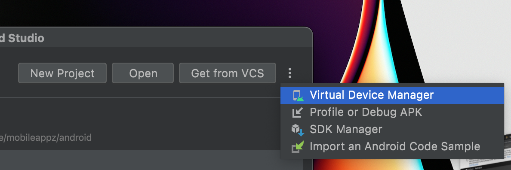

# Electricity Maps Mobile Apps

This is a capacitor project that builds the mobile apps from the web directory

## Prerequisites

- Follow this guide: https://capacitorjs.com/docs/getting-started/environment-setup (but skip the Android SDK part)
- `brew install gradle`
- install Android Studio - make sure you open it and go through the install wizard in the start
  - Also go to Tools > SDK Manager and install SDK v29
- Follow the steps here: https://www.brainfever.co.uk/2022/02/04/build-tool-32-1-0-rc1-is-missing-dx-at/
  - instead of last step, add the following to your `.zshrc` file:
  ```bash
  export JAVA_HOME='/Applications/Android Studio.app/Contents/jbr/Contents/Home'
  export PATH=$JAVA_HOME/bin:$PATH
  export PATH=$PATH:/Library/Android/sdk/platform-tools
  export PATH=$PATH:/Library/Android/sdk/tools
  export ANDROID_SDK_ROOT=~/Library/Android/sdk
  export ANDROID_HOME=~/Library/Android/sdk
  ```
- Run `pnpm install` in the **mobileapp** directory
- Navigate to the **web** directory and run `pnpm install`
- Navigate back to the **mobileapp** directory and add Capacitor apps: `pnpm exec cap add android` and `pnpm exec cap add ios`
- Run `pnpm prepare-mobile` to copy and sync assets to the capacitor apps

---

## Local development

### Run the app locally with hot reload

1. Ensure the app is running on port 5173 in one terminal window:

```bash
cd ../web
pnpm dev
```

2. In another terminal window, run one of these commands:

```bash
pnpm dev-android
pnpm dev-ios
```

### Run a production build locally

1. Make a build of the web app with proper credentials:

```bash

SENTRY_AUTH_TOKEN="" VITE_PUBLIC_ELECTRICITYMAP_PUBLIC_TOKEN="" pnpm run build-web
```

2. Then run one of these commands to open the build in XCode or Android Studio:

```bash
pnpm preview-android
pnpm preview-ios
```

3. Select appropriate simulator or device and run the app (usually a "play" icon)

---

## Publishing new mobile app versions

We use [fastlane](https://fastlane.tools/) to build and deploy the apps automatically.
See [fastlane/README.md](./fastlane/README.md) for more information.

### Setup

1. `bundle install`
2. Ensure you have the following keyfiles locally (ask the team internally to get them):
   - `.env.default`
   - `android/electricitymap.keystore`
   - `android/keystore.properties`
   - `fastlane/fastlane-key.json`
3. Update keys in `.env.default`:
   - Add your own Apple ID
   - Open https://appleid.apple.com/account/manage and create an App-Specific Password to be used for the FASTLANE_APPLE_APPLICATION_SPECIFIC_PASSWORD environment variable
   - Ask internally for the team ids

### Making a beta build

Makes a build and distributes it for internal testing.

```bash
pnpm run fast android beta
pnpm run fast ios beta
```

### Publishing to the app stores

Once beta builds have been tested and approved, you can publish them to the app stores.

```bash
pnpm run fast ios release
pnpm run fast android release
```

---

If you need more information:
https://capacitorjs.com/docs/getting-started

## Troubleshooting

<details>
  <summary>Android emulator not working?</summary>

Android studio will need a virtual device, shown here in the Android Studio opening screen:


If you get XCode error "Command PhaseScriptExecution failed with a nonzero exit code"
Then in Pods-Electricity Maps-frameworks.sh
Replace:
`source="$(readlink "${source}")"`
With:
`source="$(readlink -f "${source}")"`

</details>

<details>
  <summary>Podfile.lock being updated with cocoapods version</summary>

Install latest version of cocoapods with `gem install cocoapods`. If your version is higher, please test and commit the new change.